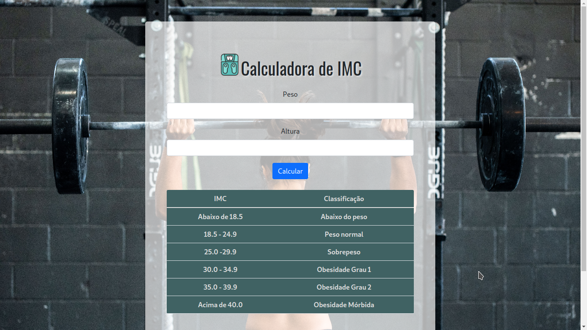

# Calculadora de IMC

Esta é uma calculadora de Índice de Massa Corporal (IMC) simples desenvolvida em JavaScript. O IMC é uma medida usada para avaliar se uma pessoa está abaixo do peso, dentro do peso normal, com sobrepeso ou obesa, com base na relação entre o peso e a altura.

## Funcionalidades

- Calcula o IMC com base no peso e altura fornecidos pelo usuário.
- Exibe o resultado do IMC e a classificação correspondente (abaixo do peso, peso normal, sobrepeso ou obeso).

## Tecnologias Utilizadas


&nbsp;
&nbsp;
&nbsp;
&nbsp;
&nbsp;

## Como Usar

1. Faça o download dos arquivos HTML, CSS e JavaScript deste projeto.
	
	```bash
	git clone git@github.com:designtechti490/calculadora-IMC.git 
	```
2. Execute um Servidor Local com o Live Server do VS Code.

	```bash
	Alt + L / Alt +O
	```

3. Insira o seu peso e altura nos campos fornecidos.
4. Clique no botão "Calcular".
5. O resultado do IMC será exibido na página.

## Tabela de Classificação de IMC

| Classificação | IMC            |
| ------------- | -------------- |
| Abaixo do peso| Menos que 18.5 |
| Peso normal   | 18.5 - 24.9    |
| Sobrepeso     | 25 - 29.9      |
| Obeso         | Mais que 30    |

## Exemplo de Uso


## Contribuição

Contribuições são bem-vindas! Se você tiver alguma sugestão, melhoria ou correção, sinta-se à vontade para enviar um pull request.

## Autor

Nome: Marcelo Junior

[](https://beacons.ai/designtechti.dev)

## Licença

Este projeto está licenciado sob a [Licença MIT](LICENSE.md).